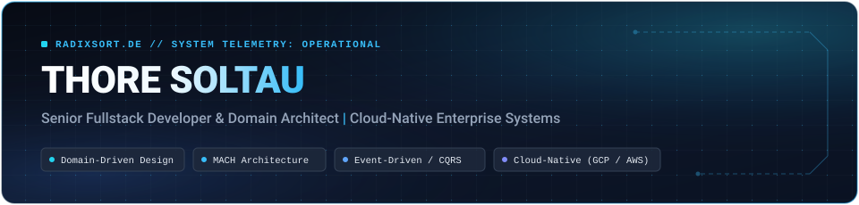

<div align="center">



<br/>
<br/>

[](https://www.radixsort.de)
[](https://github.com/thore-soltau)
[](https://www.radixsort.de)
[](mailto:soltau@radixsort.de)

</div>

<br/>

### `whoami`

> **Senior Fullstack Developer & Solution Architect** with 12+ years of hands-on experience designing, architecting, and operating resilient enterprise systems. Specializing in **Domain-Driven Design (DDD)**, **MACH Architectures**, and high-throughput **Event-Driven Microservices** with zero unplanned downtime.
>
> 📍 Based in **Düsseldorf / Duisburg, Germany**  
> 🏢 Consulting via [**WDW Consulting GmbH**](https://wdw-consulting.com) & [**radixsort.de**](https://www.radixsort.de)  
> 💼 Client / Enterprise GitHub: [@thore-soltau](https://github.com/thore-soltau)

---

### 🏛️ Strategic Architecture & Core Focus

* **Domain-Driven Design (DDD):** Strategic domain decomposition (Bounded Contexts, Context Mapping, Ubiquitous Language) and tactical patterns (Aggregates, Entities, Value Objects, Domain Events).
* **Distributed & Cloud-Native Systems:** Scalable microservice ecosystems on **GCP** & **AWS**, container orchestration via **Kubernetes**, and reproducible Infrastructure as Code (**Terraform**, **Ansible**).
* **Event-Driven Architecture (EDA):** Event Sourcing, CQRS, and asynchronous message bus architectures for decoupled enterprise operations.
* **MACH & Composable Commerce:** Headless, API-first composable platforms integrating Commercetools, Algolia, Contentstack, and Salesforce.
* **Process Automation & Orchestration:** Complex cross-domain workflow orchestration and incident management using **Camunda BPM**.
* **AI & Agentic Workflows:** Autonomous multi-agent pipelines, MCP (Model Context Protocol) integration, RAG systems, and enterprise LLM tooling.

---

### 🛠️ Tech Stack & Tooling

#### Architecture, Backend & Cloud
[](https://www.radixsort.de)
[](https://www.radixsort.de)
[](https://www.radixsort.de)
[](https://www.radixsort.de)
[](https://www.radixsort.de)
[](https://www.radixsort.de)
[](https://www.radixsort.de)
[](https://www.radixsort.de)
[](https://www.radixsort.de)
[](https://www.radixsort.de)
[](https://www.radixsort.de)
[](https://www.radixsort.de)
[](https://www.radixsort.de)
[](https://www.radixsort.de)
[](https://www.radixsort.de)

#### Frontend & Web Engineering
[](https://www.radixsort.de)
[](https://www.radixsort.de)
[](https://www.radixsort.de)
[](https://www.radixsort.de)
[](https://www.radixsort.de)

---

### 📊 Enterprise Track Record & Impact

```text
+-------------------------------------------------------------------------------+
|  Cloud-Native Replatforming & Composable Commerce                             |
|  - Modernized legacy hybrid e-commerce to cloud-native MACH platform on GCP. |
|  - Seamless integration of Commercetools, Algolia, Contentstack & Salesforce. |
+-------------------------------------------------------------------------------+
|  Enterprise B2B Integration & Telecom Provisioning                            |
|  - Engineered robust microservice backbone for carrier-grade provisioning.    |
|  - Reactive software design, CI/CD automation & architectural mentoring.       |
+-------------------------------------------------------------------------------+
|  Cross-Domain Meta-Ticketing & Process Orchestration                          |
|  - Greenfield orchestration layer synchronizing heterogeneous ticketing.      |
|  - Implemented Event Sourcing, CQRS & Hexagonal Architecture with Camunda.   |
+-------------------------------------------------------------------------------+
```

---

<div align="center">
  <sub><code>uptime: 12+ years · zero unplanned downtime · values: business-awareness/ clean-code/ mentoring/</code></sub>
  <br/>
  <sub>Explore in-depth architecture cases and system telemetry on <a href="https://www.radixsort.de"><b>radixsort.de</b></a></sub>
</div>
